# DABC_School_District_Analysis
To perform detailed analysis on academic performance for the school district to gain insights on future budgeting policy. An analysis was previously performed (v1; PyCitySchools.ipynb) prior to the current analysis (v2; PyCitySchools_Challenge.ipynb). However, due to academic dishonesty regarding reading & math grades for Thomas High School ninth graders, the analysis needs to be reperformed based on cleaned data with the abovementioned grades disregarded by replacing the scores with NaNs. The purpose of thie analysis is to compare the results with and without the abovementioned grades.

The analysis will have a number of objectives as illustrated below:

1.  A high-level snapshot of the district's key metrics, presented in a table format
2.  An overview of the key metrics for each school, presented in a table format
3. Top 5 and bottom 5 performing schools, based on the overall passing rate
4. The average math score received by students in each grade level at each school
5. The average reading score received by students in each grade level at each school
6. School performance based on the budget per student
7. School performance based on the school size 
8. School performance based on the type of school

# Resources:
- Data source: schools_complete.csv, students_complete.csv
- Software: This analysis will involve Python, Jupyter, Anaconda, and Pandas.

# Results:
## Impact on District Summary
As shown in below screenshots, excluding the reading & math grades for Thomas High School ninth graders only had a minor effect on the district's math passing percentage, reading passing percentage, and overall passing percentage, which were all reduced by less than 1 percentage point.

- District Summary v1
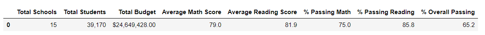</img>

- District Summary v2
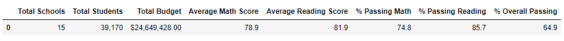</img>

## Impact on Per School Summary
As shown in below screenshots, excluding the reading & math grades for Thomas High School ninth graders had no impact on any other schools besides Thomas High School. With regards to the results for Thomas High School in v2, Average Math Score is slightly higher while Average Reading Score is slightly lower. Math passing percentage, reading passing percentage, and overall passing percentage are all lower in v2, albeit a small reduction in comparison to v2.

- Per School Summary v1
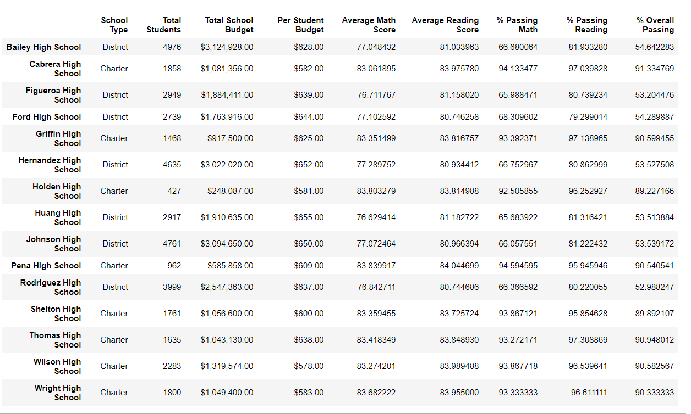</img>

- Per School Summary v2
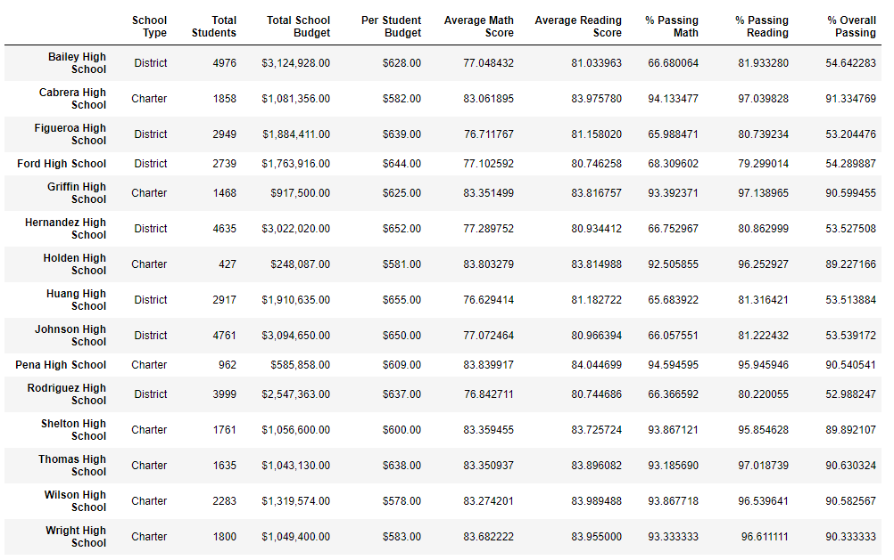</img>

## Impact on Thomas High School's performance relative to other schools
As illustrated in the above screenshots, excluding the reading & math grades for Thomas High School ninth graders had a minimal impact on Thomas High School's overall absolute performance. Therefore, it had no impact on its relative performance to other schools. The below screenshots present the top 5 schools in v1 and v2, where Thomas High School is ranked as the 2nd best performing school in the district in both analyses.

- Top 5 Schools v1
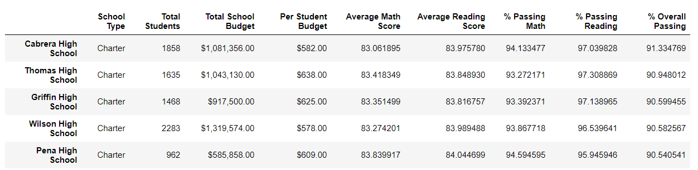</img>

- Top 5 Schools v2
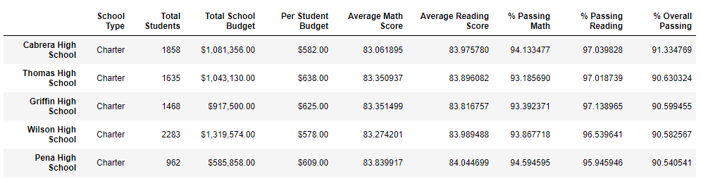</img>

## Impact on Math and Reading scores by grade
There is no impact on the summary of math and reading scores by grade except for the scores associated with Thomas High School ninth graders. Since their grades are being disregarded, the summary presents their grades as NaNs.

- Math Scores by Grade v1

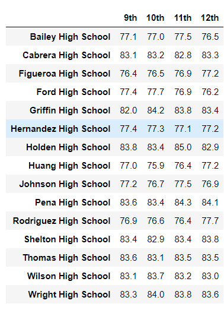</img>

- Math Scores by Grade v2

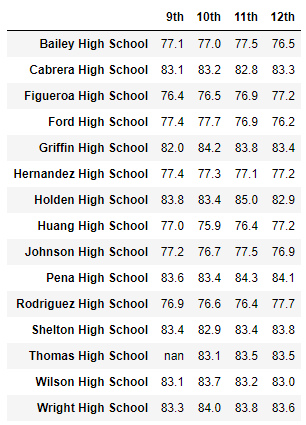</img>

- Reading Scores by Grade v1

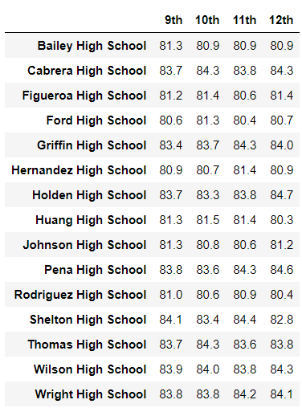</img>

- Reading Scores by Grade v2

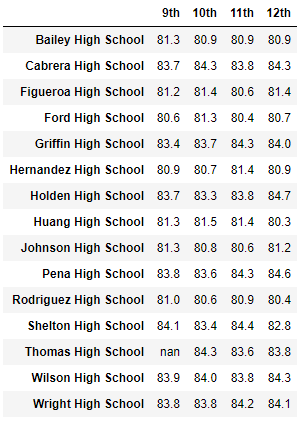</img>

## Impact on performance by school spending per student, by school size, and by school type

There is no impact on the summary of performance by school spending per student, by school size, and by school type as the impact on Thomas High School itself was very minimal. When grouped within bigger categories, the impact is more immaterial.

- Per School Spending Per Student v1

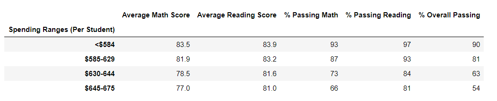</img>

- Per School Spending Per Student v2

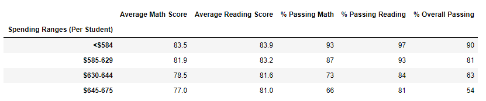</img>

- By School Size v1

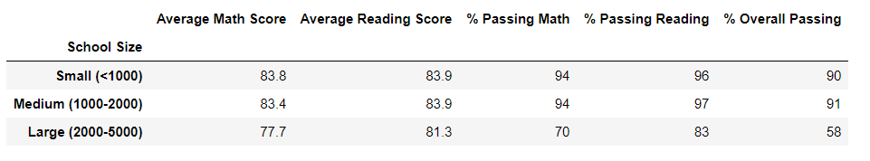</img>

- By School Size v2

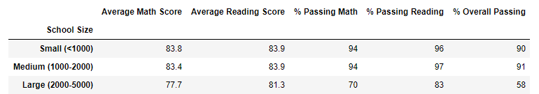</img>

- By School Type v1

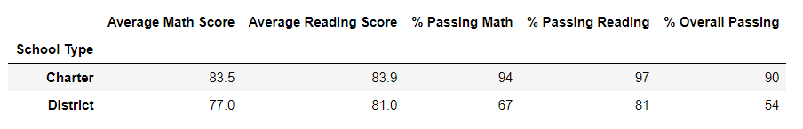</img>

- By School Size v2

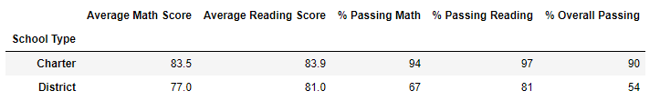</img>

# Summary
In summary, the major changes to the results of the analysis by replacing the math and reading scores for ninth graders at Thomnas High School had minor impact on :
1. the district's math passing percentage, reading passing percentage, and overall passing percentage, which were all reduced by less than 1 percentage point.
2. Thomas High School's Average Math Score, Average Reading Score, Math passing percentage, reading passing percentage, and overall passing percentage. All of the above mentioned metrics are slightly lower in v2, except for Average Math Score, which is slightly higher in v2.
3. The Math Scores summary by grade, where the average math score for ninth graders at Thomnas High School are now presented as NaNs.
4. The Reading Scores summary by grade, where the average reading score for ninth graders at Thomnas High School are now presented as NaNs.
